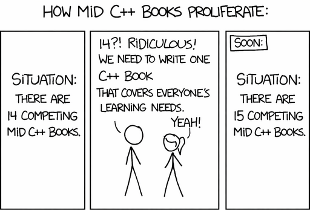
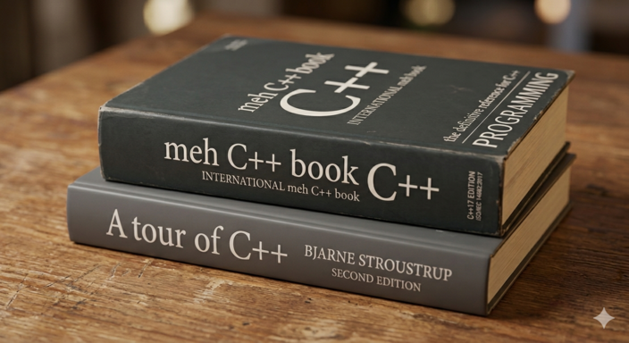

# Why?

There are lots of programming text books.
Why in the world would we do another?!?!?!
Tragically they are either mediocre or super advanced, and most are out of date since languages are evolving so quickly.
I once heard Linux Torvalds say ~1996 at USCS: I believe there will always be a niche for a free version of UNIX.
(That is what I remember at least...)
I believe there will always be a niche for free programming textbooks that evolve with the languages.

We want the books we use the match our curricula needs, so having control over our books helps.

Perhaps, the book is *meh*.
We are going for engaging, but meh can work as long as it conveys what we need.

# Books for introductory C/C++ programming classes

- [Starting C++](sc++) introduces the non-programmer to C++
- [C for C++ Programmers](c4c++) introduces C++ programmers to C. Good for an intro C/C++ class where students need both languages. Or for an Operating Systems class where students know C++  (or Java) but not C.
- Mastering C++ (TBD) object-oriented programming with C++ and advanced built-in data structures.

# AI Usage

We use AI like crazy!
Claude is our best bud.
He's super great at keeping everything consistent and accurate.
It's still a lot of work though, but we couldn't have done it without him.
